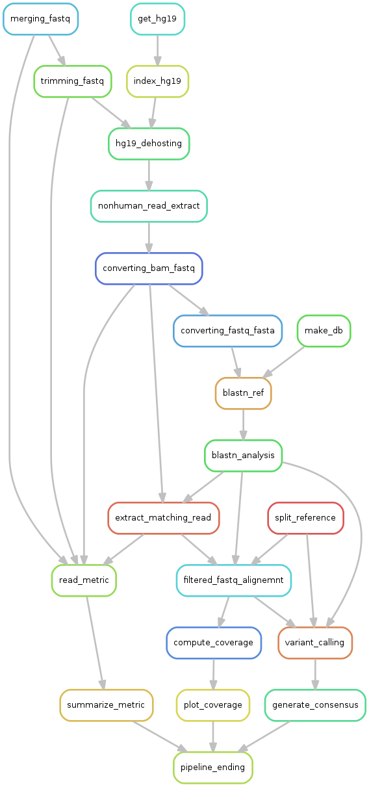

# VIRiONT Pipeline (VIRal Oxford Nanopore Technologies sequencing Pipeline)

# Quick presentation

VIRiONT pipeline is designed to analyse data from amplicon-approach-based Nanopore sequencing. It was primarily developed to analyse data from hepatitis B virus (HBV) complete genome long read sequencing after an amplification step. It was secondarily extended to hepatitis delta virus (HDV). However, this pipeline can be adapted for other viruses and pathogens as well. You just need a custom reference dataset specific to the pathogen and adapted to the amplicon design used prior your ONT sequencing.

This pipeline was primarily designed for studying HBV full genome long read sequencing (about 3kb in lenght). If you plan to use this workflow on shorter or longer amplicons, be sure to chose and adapt parameters used for the filtering steps, see below.

# Workflow

The pipeline takes as input uncompressed fastq from demultiplexed nanopore data by Guppy, usually stored like this:  
```
barcoding/barcode01/*.fastq
barcoding/barcode02/*.fastq
...
barcoding/barcode24/*.fastq
``` 
For each barcode, you can find herein the global workflow:  
**Step1** => merging if several fastq in the barcode rep.  
**Step2** => removing human reads from fastq files.  
**Step3** => trimming fastq using given parameters.  
**Step4** => blastn research on each reference for get the best maching reference(s).     
**Step5** => build consensus sequence on the best matching reference after generating alignement files with minimap2 (option splice)    

# workflow dag

<!---

-->
TO UPDATE.  

# Requirements & Tools

Installation and use of the tools required for VIRiONT is fully managed by conda and snakemake.  
Environment files and software versions are available in the *env/* folder.  

*filtering and trimming* : NanoFilt v2.7.1. See => https://github.com/wdecoster/nanofilt <=  
*dehosting and mapping* : minimap2 v2.17. See => https://github.com/lh3/minimap2 <=  
*bam management* : samtools v1.3.1. See => http://samtools.github.io/ <=  
*blastn analysis* : blast v2.5.0. See => https://blast.ncbi.nlm.nih.gov/Blast.cgi?PAGE_TYPE=BlastDocs&DOC_TYPE=Download <=  
*fastq and fasta management* : seqkit v0.12.1. See => https://github.com/shenwei356/seqkit <=  
*fastq and fasta management* : seqtk v1.3. See => https://github.com/lh3/seqtk <=   
*coverage computation* : bedtools v2.29.2. See => https://github.com/arq5x/bedtools <=   
*statistics and plotting* : R v3.6.3. See => https://cran.r-project.org/ <=  
*sequence alignment* : muscle v3.8.1551. See => http://www.drive5.com/muscle <=  
*newick tree computation* : iqtree v2.0.3. See => http://www.iqtree.org/ <=  
*tree drawing* : ete3 v3.1.2. See => http://etetoolkit.org/ <=  

# Multiple Infection case

VIRiONT can detect co-infection or contamination case when processing to the blastn analysis step.  
During this step, we proceed to a readcount matching for each reference sequences.  
The best-matching reference is used to percent normalize each readcount.  
A reference is selected if the percent normalized count is equal or above the input threshold.  
The selected references are used to independently produce as many consensus sequences as selected references for each barcode.  

*note: if you're not confident with this option, it is posssible to set the **MI_cutoff** to 100 for getting only the best-matching reference.*

# Quick using steps

Step 1 : Get and install Anaconda here if needed. More informations about conda here => https://www.anaconda.com/products/individual <=  
```
wget https://repo.anaconda.com/archive/Anaconda3-2020.07-Linux-x86_64.sh # download the linux installing script.
chmod +x Anaconda3-2020.07-Linux-x86_64.sh #give rights to execute the script.
./Anaconda3-2020.07-Linux-x86_64.sh #Simply follow screen instructions for installing conda.
#Check if conda is installed. You'll probably need to refresh/open a new terminal for starting using conda.
conda -h #print conda commands.
conda -V #print installed conda version.
```
Step 2 : make sure snakemake is installed on your computer.  

Snakemake 3.9.0 version or above is required for conda interaction.  
pandas python library is also required for dataframe reading.  
You can quikly create a new conda environment with the pandas library and the latest available snakemake version by using this command(currently the 5.20.1 version):  
```
conda create -c bioconda -c conda-forge -n VIRiONT_env snakemake-minimal pandas
```
Step 3 : download latest version of the pipeline using git command:  
```
git clone https://github.com/VIRiONT-network/VIRiONT.git
```
Step 4 : launch the pipeline by executing:  
```
conda activate VIRiONT_env #only if you previously created this environment for using VIRiONT.
cd VIRiONT
./VIRiONT_MI.sh # Generate consensus for all references over the given threshold
```

# Input and configuration

Here is a view on the parameters to check before launching analysis. Currently, to change parameters, you have to open  *VIRiONT/VIRiONT_MI.sh* with a text editor.  
All parameters are located in the ###### CONFIGURATION ####### section.  

**GENERAL PARAMETERS:**  
**data_loc** : path where fastq data are stored. Be sure this path leads on all barcode folders you want to analyse. Currently, only fastq repositories marked as "barcode*" are interpreted as repository data. If needed, rename your rep as "barcode*".  
**result_loc** : path leading to the output folders produced by the analysis. NB: the pipeline will recursively create the path, so a previous mkdir is unnecessary.  
**ref_loc** : path to the file containing all references sequences used for the blastn analysis. We you need to create a new one, check examples in *ref/* folder.  
**thread_number** : Define number of threads to be used for the analysis.  
**mem_cost** : define the memory amount in mb to be used for the analysis.  

**TRIMMING/FILTERING PARAMETERS:**  
**min_length** : minimal read size required for passing the filtering step.  
**max_length** : maximal read size required for passing the filtering step.  
**head** : nucleotid length to be trimmed in 5'.  
**tail** : nucleotid length to be trimmed in 3'.  

**VARIANT CALLING PARAMETERS:**
**maxdepth** : maximum depth for samtools mpileup.  
**basequal** : base quality cutoff for samtools mpileup.  

**CONSENSUS PARAMETERS:**   
**Vfreq** : minor variant frequency threshold to call the consensus sequence.  
**mincov** : minimun coverage expected to generate consensus sequence. N is called if below this threshold.  

**MULTI-INFECTION PARAMETER:**  
**MI_cutoff** : Percentage cutoff for detecting a multiple infection case.  Se more above in the **Multiple Infection case** section.  

# Pipeline ouputs

All pipeline outputs are stored in the choosen path (see above) and generate following folders and files:  

**param_file.txt** : a text file, summarizing parameters used for the current analysis.   
**00_SUPDATA/BD** : a folder, containing the database built using blast and individual reference sequences.  
**01_MERGED** : a folder, containing merged fastq.  
**02_DEHOSTING** : a folder, containing dehosted (non human) bam.  
**03_FILTERED_TRIMMED** : a folder, containing trimmed fastq by NanoFilt with the given parameters.  
**04_BLASTN_ANALYSIS** : a folder, containing the blastn analysis results, including the list of reads matching with the best reference, with barplot of reference repartition for each barcode.  
**05_REFILTERED_FASTQ** : a folder, containing fastq with read corresponding with the corresponding matching references.   
**06_PRECONSENSUS** : a folder, containing intermediate data related to the generated preconsensus.  
**07_BAM** : a folder, containing bam aligned on the preconsensus.  
**08_VCF** : a folder, containing mpileup and variant calling results.  
**09_CONSENSUS** : a folder, containing consensus sequences generated by a custom perl script.  
**10_QC_ANALYSIS** : a folder, containing usefull read metrics at several pipeline steps.  
**11_PHYLOGENETIC_TREE** : a folder, containing a consensus with matched reference sequences phylogenetic tree.  
**12_COVERAGE** : a folder, containing coverage table from each bam using bedtools, and coverage plots compiled into one pdf.  

